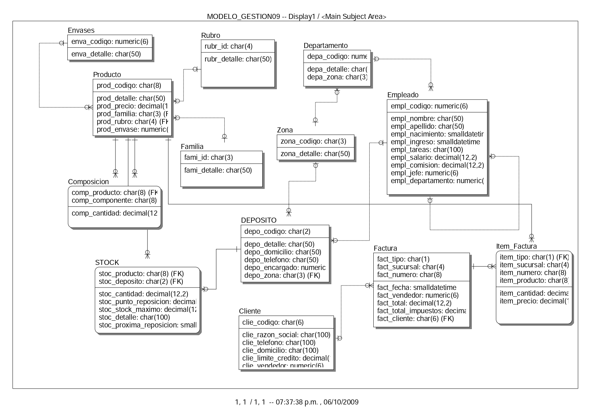

# gd-esquema-docker

Cómo practicar Gestión de Datos usando un Docker container.

## Comandos útiles

| Comando        | Acción                                      |
|----------------|---------------------------------------------|
| `make`         | Levantar el container y restaurar el backup |
| `make start`   | Solo levantar el container                  |
| `make restore` | Solo restaurar el backup                    |
| `make logs`    | Revisar los logs del container              |
| `make stop`    | Detener el container iniciado               |
| `make clean`   | Borrar el container y la imagen asociada    |

## DataGrip

### Setup

Para [DataGrip], debemos abrir la carpeta del repositorio y luego hacer
click en la base de datos desde el `Database Explorer`:

De ahí, nos va a pedir usuario y contraseña:

¡Y listo! Una vez refresquemos vamos a poder ver todas las tablas:

[DataGrip]: https://www.jetbrains.com/datagrip/download/

### Uso

En la carpeta `scripts/` están todos los ejercicios comentados, una vez
resolvamos un ejercicio le damos a `Execute`:

Y se va a mostrar el resultado:

## Azure Data Studio

### Setup

Ambas prácticas cuentan con su propio Jupyter Notebook, que podemos abrir
usando [Azure Data Studio]. Para esto, primero abriremos la carpeta del
repositorio, luego nos moveremos a `Notebooks` > `Open Notebooks in Folder`, y
por último seleccionaremos la carpeta `notebooks/`:

Una vez abiertos los notebooks, debemos vincularlos a una conexión que
estableceremos con la base de datos ya levantada haciendo click en
`Change Collection`:

Y nos conectaremos a la base de datos con los siguientes parámetros:

> Nota: La password es la misma que hayas configurado en el campo `SA_PASSWORD`
> del archivo `docker-compose.yml`

[Azure Data Studio]: https://docs.microsoft.com/en-us/sql/azure-data-studio/download-azure-data-studio

### Uso

Ambos notebooks cuentan con los enunciados y un bloque de código en donde
ingresar el query sql para luego ejecutarlo:

Una vez ejecutado, nos aparecerá el resultado, que podremos limpiar
seleccionando `...` > `Clear Result`:

